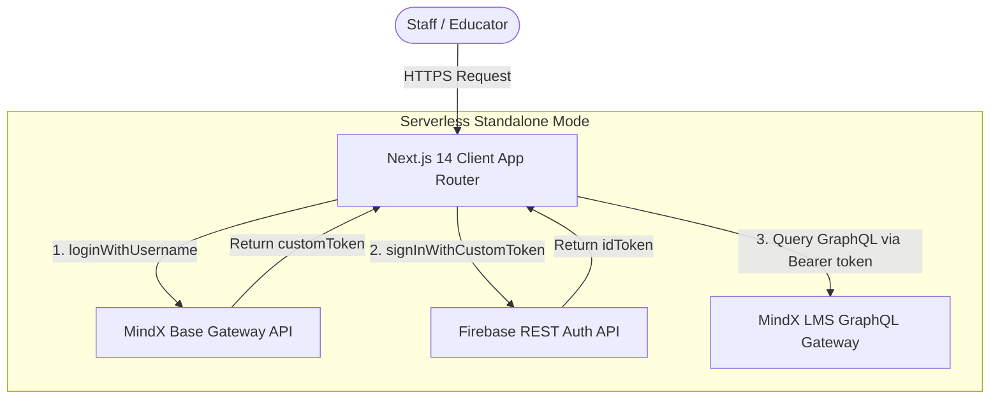

# MindX Staff Hub 🚀

> **High-Performance Production System for MindX Teacher Schedule & Operations Management**


---

## 📌 Overview

**MindX Staff Hub** is an enterprise-grade schedule management and workforce operation system tailored for MindX Technology School branches. It empowers educators and operations staff to view weekly teaching matrices, substitute classes, examiner schedules, and curriculum milestones with zero latency.

The system connects directly to **MindX LMS GraphQL API** via a secure 2-step Firebase custom token exchange, operating seamlessly in a **100% Serverless / Standalone Mode** with zero database dependencies.

---

## ✨ Key Features

### 🗓️ 1. Interactive Weekly Schedule Matrix
- Full-width dynamic schedule grid mapping slots to precise time coordinates using `colSpan` and percentage positioning.
- Touch trackpad panning, horizontal drag-to-scroll, and vertical wheel scrolling.
- Instant week navigation with zero loading delay.

### 🎯 2. 7-Level Milestone & Session Index Resolver
- Deterministic session index resolution (**Session 1 to 14**) mapped directly from LMS GraphQL slot data.
- **Module Normalization:** Automatically converts multi-level cumulative slot indices (e.g., Slot 27, 28) back into standard 1..14 curriculum module boundaries.
- **Dynamic Milestone Highlighting:**
  - 🟠 **Checkpoint 1 (Session 5/4):** Auto-applies Amber theme (`#d97706`) with `Checkpoint 1` label.
  - 🟠 **Checkpoint 2 (Session 9/8):** Auto-applies Amber theme (`#d97706`) with `Checkpoint 2` label.
  - 🟢 **Final Demo (Session 14):** Auto-applies Emerald theme (`#059669`) with `Demo` label.
  - 🔵 **Regular Classes:** MindX Navy Blue theme (`#000056`) with `Buổi X` label.

### 🏷️ 3. Direct Slot-Level Teacher Role Badges
- Fetches real-time slot teacher role assignments directly from LMS GraphQL API:
  - **GV (Lecturer / Main Teacher):** Red badge (`#E31F26`).
  - **TG (Teaching Assistant):** Yellow badge (`#FFD62D`).
  - **GK (Examiner / Judge):** Purple badge (`#9333EA`).
  - **DT (Substitute Teacher):** Rose badge (`#E11D48`).
- Automatically hides role badges when no explicit slot assignment exists for a clean, distraction-free UI.

### ⚡ 4. Two-Tier Caching & Live Refresh
- **Client-Side In-Memory Cache:** Serves previously visited weeks instantly in **0ms** via client-side TTL caching (15-minute TTL).
- **Manual Force Refresh (🔄 Button):** Bypasses client cache to perform a live fetch directly from MindX LMS GraphQL API.

---

## 🏗️ System Architecture



---

## 🛠️ Tech Stack

- **Framework:** Next.js 14 (App Router)
- **Language:** TypeScript 5.0 (Strict Type-Checking)
- **Styling:** TailwindCSS 3.4, Radix UI Primitives, Lucide Icons
- **Typography:** Google Fonts (`Plus Jakarta Sans`, `Inter`, `JetBrains Mono`)
- **API & Auth:** Axios, GraphQL Queries/Mutations, Firebase Identity Toolkit
- **Date Handling:** `date-fns` (UTC+7 Asia/Ho_Chi_Minh Timezone)

---

## 🚀 Getting Started

### Prerequisites

- **Node.js:** `>= 18.17.0` (LTS recommended)
- **Package Manager:** `npm` or `pnpm`

### Environment Configuration

Create a `.env.local` file in the root directory:

```env
# ── LMS Gateway Endpoints ──
NEXT_PUBLIC_LMS_BASE_API=https://base-api.mindx.edu.vn/
NEXT_PUBLIC_LMS_GATEWAY_API=https://lms-api.mindx.edu.vn/
NEXT_PUBLIC_FIREBASE_API_KEY=your_firebase_api_key_here

# ── Gateway Credentials Placeholder ──
NEXT_PUBLIC_LMS_USERNAME=your_lms_username
NEXT_PUBLIC_LMS_PASSWORD=your_lms_password

# ── Default Centre ID Placeholder ──
NEXT_PUBLIC_DEFAULT_CENTRE_ID=your_centre_id_here
```

> 🔒 **Security Warning:** Never commit `.env` or production credentials to public version control.

### Installation & Development

```bash
# Clone the repository
git clone https://github.com/TranTrungHjeu/mindx-staff-hub.git
cd mindx-staff-hub

# Install dependencies
npm install

# Run development server
npm run dev
```

Open [http://localhost:3001](http://localhost:3001) in your browser.

---

## 📦 Production Deployment

### Deploying on Vercel

1. Push your code to your GitHub repository.
2. Import the project into [Vercel](https://vercel.com).
3. Configure the environment variables in **Project Settings > Environment Variables**:
   - `NEXT_PUBLIC_FIREBASE_API_KEY`
   - `NEXT_PUBLIC_LMS_USERNAME`
   - `NEXT_PUBLIC_LMS_PASSWORD`
   - `NEXT_PUBLIC_DEFAULT_CENTRE_ID`
4. Click **Deploy**.

---

## 🔒 Security & Compliance

- **No Hardcoded Credentials:** All credentials and API keys are strictly loaded via environment variables.
- **Dynamic 2-Step Token Authentication:** Authenticates against Base API to obtain a custom token, which is exchanged via Firebase Identity Toolkit before querying LMS GraphQL API.
- **Origin & Referer Safeguards:** Ensures requests match authorized MindX domain origins.

---

## 📄 License

Proprietary software owned by **MindX Technology School**. Authorized internal use only.

*Copyright © 2026 MindX Staff Hub. All rights reserved.*
